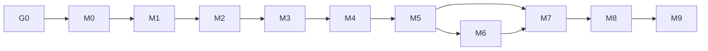

# PhoneLens: Implementation Plan

| | |
|---|---|
| Version | 1.0 |
| Date | 2026-10-04 |
| Derived from | `spec.md` v1.3.3 §13 and §11 |
| Rule | If this document and `spec.md` disagree, `spec.md` wins. Task IDs here are the IDs used in `TRACKER.md`. |

---

## 1. How to use this plan

Work one task at a time, in dependency order. Each task has files, an acceptance test and requirement links. Mark a task Done in `TRACKER.md` only when the acceptance statement is true and you can name the evidence (a test, a file or a commit).

The plan has 67 tasks in Gate 0 and ten milestones. The order is: decisions, data, feature contract, models, intervals and out-of-fold predictions, analytics, API, UI, audit. The contract is frozen at M5-07; changing it afterwards means redoing M7 and M8.

## 2. Ground rules for every task

1. Read `AGENTS.md`, the spec sections listed on the task, and `MEMORY.md` before editing.
2. Write the test with the code, not after. A task is not Done without its tests.
3. Never loosen a gate, change a threshold constant, edit the forbidden-feature list or edit a test to make something pass. If a gate seems wrong, open a spec change.
4. One commit per task, message starting with the task ID.
5. Update `TRACKER.md` (status and evidence) and, if you learned a trap, `MEMORY.md`.
6. Run the task's tests, then `make ci`, before marking Done.
7. If the task needs a decision the spec does not make, record it in `MEMORY.md` as an implementation choice rather than guessing silently.

Definition of done for a task: acceptance true, tests written and passing, `make ci` green, TRACKER updated, committed.

## 3. Effort and critical path

Sizes: S about 1.5 hours, M about 4 hours, L about 8 hours. These hours are my assumption, not a measurement of your pace.

| Milestone | Name | Tasks | Hours (assumed) | Working days (8 h) | Spec §13 label |
|---|---|---|---|---|---|
| G0 | Gate 0: decisions before code | 3 | 4.5 | 0.6 | before M0 |
| M0 | M0 Setup | 5 | 7.5 | 0.9 | S |
| M1 | M1 Data | 7 | 18 | 2.2 | S |
| M2 | M2 Feature and preprocessing contract | 3 | 7 | 0.9 | S |
| M3 | M3 Regression | 7 | 15.5 | 1.9 | L |
| M4 | M4 Classification | 6 | 14 | 1.8 | M |
| M5 | M5 Intervals, explanations, OOF, contract freeze | 8 | 27 | 3.4 | M |
| M6 | M6 Analytics logic | 5 | 19 | 2.4 | M |
| M7 | M7 Flask API | 7 | 20.5 | 2.6 | M |
| M8 | M8 UI | 10 | 47 | 5.9 | L |
| M9 | M9 Audit and submission | 6 | 11.5 | 1.4 | M |
| Total |  | 67 | 191.5 | 23.9 | about 10.5 days if summed |

The spec's milestone labels (S under half a day, M about a day, L two days or more) sum to about 10.5 days. The bottom-up figure above is about 24 working days for one person. I trust the bottom-up figure more because it counts the tasks, but both are guesses. The longest dependency chain is about 12 working days, which is the floor if work is perfectly parallel (it will not be).

**If the deadline is under about three weeks, apply the cut list in section 9 from the start rather than at the end.**

## 4. Milestone dependencies



Within milestones, many tasks are independent; each task table lists its own dependencies.

## Gate 0: Gate 0: decisions before code

Settle the open items that change what gets built.

| ID | Task | Files | Acceptance | Requirements | Depends on | Size |
|---|---|---|---|---|---|---|
| G0-01 | Get the syllabus or marking rubric and list any mandated algorithms | spec.md §6.2, §8.2; MEMORY.md | If algorithms are named, rows are added to the candidate tables and decision D-23 is recorded; otherwise "none required" is recorded | — | — | S |
| G0-02 | Check the target machine: Python version, pip installs, make or Windows equivalents | MEMORY.md | Versions recorded; a dry-run install of requirements succeeds | NFR-8 | — | S |
| G0-03 | Confirm dataset source, licence and currency (not blocking until M9) | README.md, artifacts/model_card.md | Source cited, licence noted or flagged unconfirmed, INR confirmed or caveat kept | FR-S5 | — | S |

**Exit criteria.** Syllabus question answered and recorded; target machine checked; dataset source, licence and currency queries started.

**Run.** none (decisions and checks)

## M0: M0 Setup

Repo, dependencies, config, Makefile and an empty but green CI.

| ID | Task | Files | Acceptance | Requirements | Depends on | Size |
|---|---|---|---|---|---|---|
| M0-01 | Create the repository skeleton | every directory and __init__.py in docs/PROJECT_STRUCTURE.md; .gitignore | Tree matches the structure document; AGENTS.md loads in Antigravity | NFR-9 | G0-01 | S |
| M0-02 | Dependencies and Makefile | requirements.txt, requirements-dev.txt, Makefile, README command table | make setup works in a clean virtualenv; every target has a non-make equivalent | NFR-8 | M0-01 | S |
| M0-03 | Central config | src/phonelens/config.py | Seed, thresholds, band edges, mainstream limit, group minimums, margins and paths exist once; no other module hardcodes them | NFR-9, NFR-7 | M0-01 | S |
| M0-04 | Lint and test harness | pyproject.toml, tests/test_smoke_import.py, tests/test_import_graph.py | make ci passes with a placeholder test; ruff and coverage configured | NFR-6 | M0-02 | S |
| M0-05 | Place the raw CSV and record its SHA-256 | data/raw/smartphone_v5.csv, src/phonelens/data/load.py (file_sha256) | Hash is printed by make data and noted in MEMORY.md | NFR-2 | M0-01 | S |

**Exit criteria.** Repo, dependencies, `config.py`, Makefile in place; `make ci` passes with placeholder tests.

**Run.** `make setup` then `make ci`

## M1: M1 Data

Clean data, duplicate groups, locked splits.

| ID | Task | Files | Acceptance | Requirements | Depends on | Size |
|---|---|---|---|---|---|---|
| M1-01 | Loader with explicit schema and row_id | data/load.py, data/schema.py | Fails fast on a missing column; row_id is 0 to 979 in raw order | NFR-2 | M0-05 | S |
| M1-02 | Cleaning pipeline | data/clean.py, data/processed/phones_clean.csv | Idempotent; sentinel counts 143 and 68 asserted; invariants asserted; model_display kept | — | M1-01 | M |
| M1-03 | Duplicate grouping and collision audit | data/groups.py, reports/group_audit.json | 733 groups; 424 rows in multi-row groups; zero under-merged clusters; iQOO case grouped | FR-A6 | M1-02 | M |
| M1-04 | Outer split | data/split.py | 784 train and 196 test rows; no shared dup_group; segment shares within 3 points | NFR-7 | M1-03 | S |
| M1-05 | CV_SPLITS, brand-holdout splitter and positions_for | data/split.py, artifacts/splits.json | 15 splits of row_id arrays; round trip returns the same row_ids; no test row appears | NFR-2 | M1-04 | M |
| M1-06 | Data tests | tests/test_clean.py, test_groups.py, test_split.py | Every Cleaning, Grouping and Splitting row in spec §11 passes | NFR-6 | M1-05 | S |
| M1-07 | EDA notebook (optional) | notebooks/01_eda.ipynb | Reproduces the §2 audit numbers; nothing imports the notebook | — | M1-02 | S |

**Exit criteria.** Clean CSV written; sentinel counts asserted; grouped stratified outer split tested; leakage test passing; group audit counts match §3.1 (733 groups, zero under-merged clusters).

**Run.** `make data`; `pytest tests/test_clean.py tests/test_groups.py tests/test_split.py`

## M2: M2 Feature and preprocessing contract

One feature list and two preprocessors.

| ID | Task | Files | Acceptance | Requirements | Depends on | Size |
|---|---|---|---|---|---|---|
| M2-01 | Feature contract | features/spec.py | 23 features with types and groups; FORBIDDEN list; test_no_leakage passes | NFR-9, NFR-7 | M1-06 | S |
| M2-02 | Preprocessors | features/build.py, tests/test_features.py | build_preprocessor('tree') and ('linear') output dense arrays; rare and unseen brands encode identically; dropdown list equals categories_ minus infrequent_categories_ | — | M2-01 | M |
| M2-03 | Leakage test harness | tests/test_leakage.py | Group-overlap and label-shuffle helpers exist and run on a toy model | NFR-7 | M2-02 | S |

**Exit criteria.** `features/spec.py` and both `build_preprocessor` variants done; rare and unseen category behaviour tested; `CV_SPLITS` and the brand-holdout splitter generated and saved.

**Run.** `pytest tests/test_features.py tests/test_leakage.py`

## M3: M3 Regression

Baselines, tuned candidates, selection and gates.

| ID | Task | Files | Acceptance | Requirements | Depends on | Size |
|---|---|---|---|---|---|---|
| M3-01 | Metrics module | models/evaluate.py, tests/test_metrics.py | mdape, r2_log, mae and per-segment errors match hand-computed values; no helper computes MdAPE on log residuals | NFR-7 | M2-03 | S |
| M3-02 | Baselines and candidates | models/regression.py | Dummy, tuned Ridge, RF and HGB defined with the §6.2 search spaces; RandomizedSearchCV runs on CV_SPLITS | — | M3-01 | M |
| M3-03 | Selection and paired comparison | models/evaluate.py, tests/test_selection.py | Win count, mean paired gain and the delta rule implemented and tested | — | M3-02 | S |
| M3-04 | Fit and save the regressor | scripts/train.py, artifacts/regressor.joblib | Trained on the training portion only; bundle is a plain dict; deterministic | NFR-2 | M3-03 | S |
| M3-05 | Brand-held-out diagnostic | models/evaluate.py | Pooled R² and MdAPE plus per-brand table for the 17 brands with n of 10 or more | FR-M3 | M3-04 | S |
| M3-06 | Regression leakage audit | tests/test_leakage.py | Label-shuffle R² at most 0.05; top-feature ablation reported | NFR-7 | M3-04 | M |
| M3-07 | Regression gate check | TRACKER.md gate table | QG-01 recorded with measured values; failures follow the plan's failure procedure | NFR-7 | M3-05, M3-06 | S |

**Exit criteria.** Baselines and tuned model trained on `CV_SPLITS`; §6.3 gates pass; MdAPE scorer and definitions tested.

**Run.** `pytest tests/test_metrics.py tests/test_selection.py tests/test_leakage.py`; `python -m scripts.train`

## M4: M4 Classification

Candidates, calibration choice and gates.

| ID | Task | Files | Acceptance | Requirements | Depends on | Size |
|---|---|---|---|---|---|---|
| M4-01 | Classification candidates and baselines | models/classification.py | Majority, regress-then-bin, tuned logistic regression, RF (balanced), HGB | FR-C1 | M3-04 | M |
| M4-02 | Selection by macro-F1 | models/classification.py, models/evaluate.py | Delta 0.01 rule applied on CV_SPLITS | — | M4-01 | S |
| M4-03 | Calibration comparison | models/classification.py, tests/test_calibration.py | CAL_SPLITS built from row_id, passed as a list; choice by log loss with 0.005 margin; recorded in the manifest | FR-C2 | M4-02 | M |
| M4-04 | Classification metrics | models/evaluate.py | Per-class precision and recall, confusion matrix, QWK, Budget-Premium count, log loss, Brier, reliability data | FR-M2 | M4-02 | S |
| M4-05 | Classification leakage audit | tests/test_leakage.py | Adding price trips the 0.97 limit and triggers the audit; shuffled-label accuracy within majority plus 0.05 | NFR-7 | M4-02 | S |
| M4-06 | Classification gate check | TRACKER.md gate table | QG-05 and QG-08 recorded | NFR-7 | M4-03, M4-04, M4-05 | S |

**Exit criteria.** §8.4 gates pass; regress-then-bin comparison reported; calibration choice made on grouped CV and recorded.

**Run.** `pytest tests/test_calibration.py tests/test_leakage.py`; `python -m scripts.train`

## M5: M5 Intervals, explanations, OOF, contract freeze

Everything the API will serve, built and frozen.

| ID | Task | Files | Acceptance | Requirements | Depends on | Size |
|---|---|---|---|---|---|---|
| M5-01 | Per-band intervals | models/uncertainty.py, tests/test_uncertainty.py | Quantiles per band with fallback below 50 residuals; expm1 bounds exact at 3,499 and 650,000 | FR-P2 | M3-04 | M |
| M5-02 | Explainability | models/explain.py, tests/test_explain.py | Importance from validation folds grouped by feature group; sensitivity template test passes | FR-P3, FR-M2 | M5-01 | M |
| M5-03 | Comparables | models/comparables.py, artifacts/comparables.joblib, tests/test_comparables.py | Distances match NearestNeighbors(algorithm='brute') on 200 queries; deterministic ties | FR-P4 | M2-01 | S |
| M5-04 | Final evaluation on the locked test set | scripts/evaluate.py, artifacts/metrics.json, tests/test_model_gates.py | Reads test rows once; QG-02, QG-03, QG-04 and QG-06 recorded; bootstrap CIs optional | FR-M1, NFR-7 | M4-06, M5-01 | M |
| M5-05 | Out-of-fold predictions for analytics | scripts/build_analytics.py, artifacts/analytics.json | OOF z_hat for all 980 rows with frozen hyperparameters; q_band stored | FR-A5 | M5-01 | M |
| M5-06 | Artifact IO, manifest and version guard | service/artifacts.py, tests/test_artifacts.py | Manifest fields per §12.3; mismatch refuses to start; override shows the banner flag | FR-S3, NFR-2 | M4-06 | M |
| M5-07 | Options builder, presets and schema draft; contract freeze | service/predictor.py (options), webapp/schemas.py | Presets chosen by rule; brand list from the encoder; contract tagged and recorded in MEMORY.md | FR-P1, FR-S4 | M5-02, M5-03, M5-05, M5-06 | M |
| M5-08 | Model card generator | artifacts/model_card.md | Contains every section listed in spec §12.4 | FR-M3 | M5-04 | S |

**Exit criteria.** Per-band intervals meet §6.4 gates; permutation importance from validation folds; comparables index; OOF predictions written; `schemas.py` and the `/api/meta/options` shape frozen; artifacts and manifest final.

**Run.** `make train && make evaluate && make analytics`; `pytest tests/test_uncertainty.py tests/test_explain.py tests/test_comparables.py tests/test_model_gates.py tests/test_artifacts.py`

## M6: M6 Analytics logic

Aggregation, views and the Value Finder.

| ID | Task | Files | Acceptance | Requirements | Depends on | Size |
|---|---|---|---|---|---|---|
| M6-01 | Filters and aggregation core | analytics/aggregates.py | Filter normalisation, sorted-tuple cache key, suppression for n below 10 | FR-A1, FR-A3 | M5-07 | M |
| M6-02 | View builders | analytics/aggregates.py | All 13 view ids return the payload shape in BACKEND_SCHEMA | FR-A2, FR-A4 | M6-01 | L |
| M6-03 | Value Finder | analytics/value_finder.py | score = resid / q_band; labels; ranking; default exclusion above 150,000; banned words absent | FR-A5 | M5-05 | M |
| M6-04 | Takeaways and caveats | analytics/aggregates.py | Generated one-line takeaway and the §7.2 caveat per view | FR-A2 | M6-02 | S |
| M6-05 | Analytics tests | tests/test_analytics.py | Cache hit for equivalent filters; suppression; Value Finder boundary cases | NFR-6 | M6-03, M6-04 | S |

**Exit criteria.** Aggregates, suppression rule and Value Finder scores produced from `analytics.json` and the cleaned frame; tests green.

**Run.** `pytest tests/test_analytics.py`

## M7: M7 Flask API

Contract-tested service.

| ID | Task | Files | Acceptance | Requirements | Depends on | Size |
|---|---|---|---|---|---|---|
| M7-01 | App factory, config classes, logging, headers | webapp/__init__.py | create_app works for Development, Production and Testing; CSP and nosniff headers; one log line per request with a request id | NFR-5, FR-S4 | M5-07 | M |
| M7-02 | Schemas and validation | webapp/schemas.py | Request, response and error models per BACKEND_SCHEMA; cross-field rules; category fields as constrained strings; three fast-charging states | FR-P6, FR-P5 | M7-01 | M |
| M7-03 | Predictor service | service/predictor.py, tests/test_predictor.py | predict and classify return the §9.3 shapes; borderline logic; category_status; one batched sensitivity call | FR-P2, FR-P3, FR-C1, FR-C3 | M7-02 | M |
| M7-04 | API routes | webapp/routes/api.py | POST predict and classify; GET analytics, meta/options, models/metrics; JSON 404 under /api | FR-S4 | M7-03, M6-04 | S |
| M7-05 | Page routes and healthz | webapp/routes/pages.py, templates stubs | All five pages render the base template; /healthz returns versions | FR-S4 | M7-01 | S |
| M7-06 | Version-guard banner wiring | webapp/__init__.py, templates/partials/banner.html | Override flag renders the banner on every page | FR-S3 | M7-05 | S |
| M7-07 | API tests and latency | tests/test_api.py, tests/test_latency.py | Every row in the spec §11 API table passes; p95 under 150 ms | NFR-1, NFR-6 | M7-04, M7-06 | M |

**Exit criteria.** All routes in §9.2 live; contract tests green; p95 under 150 ms; version guard works.

**Run.** `pytest tests/test_predictor.py tests/test_api.py tests/test_latency.py`; `make run`

## M8: M8 UI

Tokens, components, five pages.

| ID | Task | Files | Acceptance | Requirements | Depends on | Size |
|---|---|---|---|---|---|---|
| M8-01 | Static foundation | static/css/tokens.css, base.css, layout.css; static/fonts; static/vendor; templates/base.html | Tokens match spec §10.2; Manrope and Plotly vendored; nav, footer and banner slots exist; no external requests | FR-S2, FR-S5, NFR-4 | M7-05 | M |
| M8-02 | Component library | static/css/components.css | Buttons, inputs, segmented controls, cards, badges, tables, skeletons, notices, accordion with all states | NFR-3, NFR-4 | M8-01 | L |
| M8-03 | Spec form partial and client logic | templates/partials/spec_form.html, static/js/{api,form,options,format}.js | Presets, fast-charging three-state, resolution preset, expandable-storage toggle, inline errors | FR-P1, FR-P6 | M8-02, M7-04 | L |
| M8-04 | Predict page | templates/predict.html, static/js/predict.js | Result card shows price, nominal range, coverage caption, sensitivity, comparables, notices, model info | FR-P2, FR-P3, FR-P4, FR-P5, FR-P7 | M8-03 | M |
| M8-05 | Classify page | templates/classify.html, static/js/classify.js | Badge, three probability bars, calibration caption, borderline notice, comparables, cross-link | FR-C1, FR-C2, FR-C3, FR-C4 | M8-03 | M |
| M8-06 | Analytics page | templates/analytics.html, static/js/{analytics,charts}.js | Tabs, filters with query-string state, charts, takeaway, caveat, details tables, Value Finder banner | FR-A1, FR-A2, FR-A4, FR-A5 | M8-02, M7-04 | L |
| M8-07 | Models page | templates/models.html, static/js/models.js | Metrics tables, confusion matrix, reliability diagram, importance bars, failure modes, data notes, group audit | FR-M1, FR-M2, FR-M3, FR-A6 | M8-02, M5-08 | M |
| M8-08 | Home page | templates/home.html | Hero, three module cards, four KPI facts, audit headline | FR-S1, FR-S5 | M8-02 | S |
| M8-09 | Responsive and accessibility pass | all templates and CSS | Checked at 375, 768 and 1440 px; contrast and focus verified; no colour-only signal | NFR-3, NFR-4 | M8-04, M8-05, M8-06, M8-07, M8-08 | M |
| M8-10 | Browser smoke tests (optional) | tests/smoke/, make smoke | Three Playwright tests pass, or the manual fallback is documented | NFR-6 | M8-09 | S |

**Exit criteria.** Tokens and components implemented; Predict, Classify, Analytics and Models pages work end to end; keyboard-only pass done.

**Run.** `make run` and the manual checklist; `make smoke` if Playwright is installed

## M9: M9 Audit and submission

Verify every claim, then freeze.

| ID | Task | Files | Acceptance | Requirements | Depends on | Size |
|---|---|---|---|---|---|---|
| M9-01 | Verify the §1.3 checklist with evidence | TRACKER.md | Each of the eight items has a test name or artifact path beside it | NFR-7 | M8-09 | S |
| M9-02 | README | README.md | Quickstart, command table with Windows equivalents, results table, structure, limitations, attribution | NFR-8, FR-S5 | M8-09 | S |
| M9-03 | Report and demo rehearsal | report/ (outside repo or docs/report.md) | Report follows §14.1; the five-minute demo runs in time; viva table reviewed against final numbers | — | M9-01 | M |
| M9-04 | CI, coverage and determinism | make ci, tests/test_reproducibility.py, tests/test_copy_rules.py | QG-11, QG-12 and QG-13 pass | NFR-6, NFR-2 | M8-09 | S |
| M9-05 | Manual UI checklist | TRACKER.md | QG-14 passes and is recorded | NFR-3, NFR-4, FR-S2 | M8-09 | S |
| M9-06 | Close open items and freeze | MEMORY.md, README.md | G0-03 closed; every number in the report matches metrics.json; release tagged | FR-S5 | M9-03, M9-04, M9-05, G0-03 | S |

**Exit criteria.** Model card, data-notes accordion and README complete; coverage target met; every §1.3 item verified; offline demo checked at 375px and 1440px; `make smoke` passes or the documented fallback is used.

**Run.** `make ci`; `make smoke`; `pytest tests/test_reproducibility.py tests/test_copy_rules.py`

## 5. Parallel work

Parallel agents in Antigravity's Agent Manager (or parallel humans) are safe only on disjoint files. These pairs do not share files:

| Pair | Why it is safe |
|---|---|
| M5-03 (comparables) with M3 and M4 | Starts after M2-01; touches only `models/comparables.py` |
| M6 with M7-01 to M7-03 | `analytics/` against `webapp/` and `service/predictor.py` |
| M8-01 and M8-02 with M7-04 to M7-07 | `static/` and `templates/` against `webapp/routes` and tests |
| M9-02 (README) with anything | Touches only `README.md` |

Rules for parallel work: separate branches, one directory owner per branch, nobody edits `config.py`, `features/spec.py`, `webapp/schemas.py` or `spec.md` without being the task owner, and merge in dependency order.

## 6. Gate failure procedures

A failed gate is a finding, not an obstacle. These steps apply in order. None of them involves loosening a threshold.

| Gate | Symptom | Procedure |
|---|---|---|
| QG-01 | No candidate beats tuned Ridge on MdAPE | Check that preprocessing is dense and NaN is handled as designed, that the scorer applies `expm1` to both sides, and that the search space matches the spec. Widen the search only inside the ranges the spec lists. If it still fails, report that no model beat the baseline. Do not change δ or the 10-of-15 rule. |
| QG-02 | Test MdAPE above 16% or R² below 0.82 | Compare with the CV figures and the per-segment error table. If CV passes and test fails, check the test composition and group overlap. Do not retune on the test set. Report the numbers as they are. |
| QG-03 / QG-06 | Test R² above 0.93 or accuracy of 0.97 or more | Run the full leakage audit: feature-list test, group-overlap test, label-shuffle, top-feature ablation. Look at the top importances for a feature that encodes price. The run is not accepted until all four pass. A high score is a trigger for scrutiny, not proof of leakage. |
| QG-04 | Interval coverage outside the gates | First look for bugs: OOF predictions must use grouped folds; the band comes from predicted price; the fallback applies below 50 residuals; bounds use `expm1`. If coverage is still outside the gates, record the measured values and open a spec change with the evidence. Do not widen intervals silently. |
| QG-05 | Classifier does not beat regress-then-bin | Report it. Module C still shows probabilities near boundaries, but the report states that the baseline matched or beat it. Raise a spec question before removing the module. |
| QG-07 | Shuffled-label score is high | This means the pipeline leaks something. Stop. Check that the label is not derivable from a feature, that preprocessing is fit inside folds, and that no test row is used in fitting. |
| QG-08 | Calibration comparison is unclear | Apply the rule exactly: lower mean log loss over `CV_SPLITS` wins; a difference under 0.005 goes to uncalibrated. Record the numbers either way. |
| QG-09 | Group audit counts differ from §3.1 | Counts depend on the exact keys. Check string normalisation first (whitespace and case), then the fingerprint columns. Do not edit the expected counts until the difference is understood. |
| QG-10 | Latency over 150 ms | Confirm sensitivity variants are scored in one batched call and that artifacts load once at startup. Check the number of trees. Profile before changing anything. |
| QG-11 | Coverage below 80% | Add tests for uncovered branches. Do not exclude files from coverage. |
| QG-12 | Two runs differ | Check `random_state` everywhere, `n_jobs` and BLAS thread settings, and that the tolerance is the specified `rtol=1e-6, atol=1e-8`. Hash mismatches are real failures. |
| QG-14 | Manual checklist item fails | Fix, then rerun the whole checklist and record the date. |

## 7. Task hand-off template

Copy this into an agent session, filling the angle brackets from the task table:

```text
Task: <ID> <title>
Read first: AGENTS.md; spec.md <sections>; docs/BACKEND_SCHEMA.md <sections>; MEMORY.md (traps)
You may edit: <files from the task row>
You must not edit: spec.md; thresholds in config.py (unless this is M0-03); the FORBIDDEN list in
  features/spec.py; tests that belong to other tasks
Acceptance: <acceptance column>
Verify with: <run command for the milestone>, then make ci
Finish: set the task to Done in TRACKER.md with evidence; add any trap to MEMORY.md;
  commit as "<ID>: <title>"
If anything in the spec is ambiguous or contradicts itself, stop and say so.
```

## 8. End-of-project verification (M9)

1. Walk the §1.3 checklist in `TRACKER.md` and write the test name or artifact path beside each item.
2. Confirm every number in the report equals the value in `artifacts/metrics.json`.
3. Run the five-minute demo from `spec.md` §14.2 with the network off.
4. Confirm the README states the INR assumption, the licence status and the attribution.
5. Close G0-03 or leave it open and say so in the report.

## 9. Cut list

From `spec.md` §13.1. Cut in this order and keep everything else:

1. Bootstrap CIs on the test set (the Models page labels them "CIs omitted").
2. Partial dependence plots.
3. Violin and correlation-heatmap views.
4. The Value Finder scatter (keep the table).
5. Per-brand MdAPE table.
6. Comparables (task M5-03 and requirement FR-P4).
7. pydantic (plain validation functions, same error shape).
8. Browser smoke tests (keep the manual checklist).

**Never cut:** the leakage guard, grouped splits, baselines, intervals with measured coverage, the API contract, the three module pages, the model card.