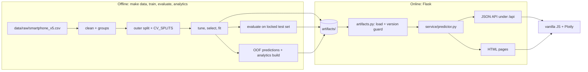
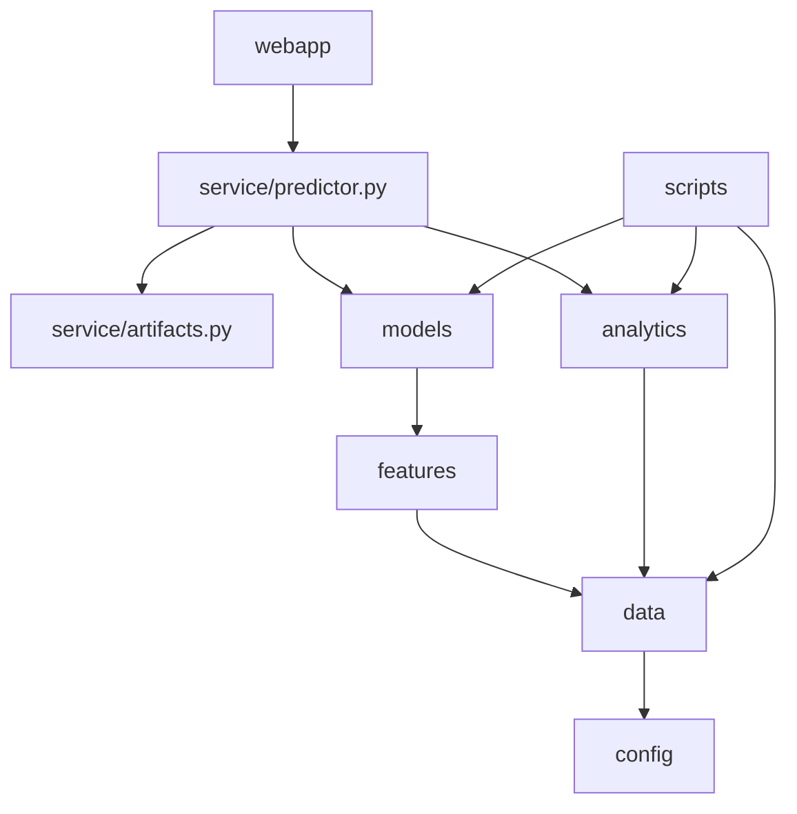

# PhoneLens: Technical Requirements Document

| | |
|---|---|
| Version | 1.0 |
| Date | 2026-10-04 |
| Derived from | `spec.md` v1.3.3 |
| Rule | If this document and `spec.md` disagree, `spec.md` wins. Where this document adds an implementation choice the spec leaves open, it says **Implementation choice**. |

---

## 1. Purpose

This document says how PhoneLens is built: the stack, the module boundaries, the algorithms, the artifacts and the service. It is written for whoever writes the code, human or agent. Requirements and acceptance criteria live in `docs/PRD.md`; data and API shapes live in `docs/BACKEND_SCHEMA.md`.

## 2. System overview

Training is offline. Flask only loads artifacts and serves them. Nothing is trained, tuned or refit at request time.



Three properties hold everywhere:

1. **One feature list.** `features/spec.py` defines the 23 model features. Regression, classification, the API schema and the form all derive from it.
2. **One grouping key.** `dup_group` decides every split, CV fold and calibration fold.
3. **One config.** Seed, thresholds and margins live in `config.py` and nowhere else.

## 3. Technology stack

| Layer | Choice | Version | Status |
|---|---|---|---|
| Language | Python | 3.12 (verified on 3.12.3) | Confirm on the target machine (G0-02) |
| Web | Flask | `>=3.1.3,<3.2` | Release confirmed |
| ML | scikit-learn | `>=1.8,<1.9` (verified on 1.8.0) | Confirmed |
| Data | pandas, numpy | `>=3.0,<3.1` (3.0.2), `>=2.0` (2.4.4) | Verified |
| Persistence | joblib | any; exact version recorded in the manifest | Verified |
| Validation | pydantic | `>=2.7,<3` | **Bound not confirmed**; check on install |
| Charts | Plotly.js | 3.2.0, vendored | Version confirmed; cartesian bundle filename **not confirmed** |
| Font | Manrope | self-hosted woff2, SIL OFL | Check the ₹ glyph |
| Frontend | Vanilla JS (ES modules), CSS, Jinja2 | no build step | Decision |
| Dev | pytest, pytest-cov, ruff | latest compatible | |
| Optional | waitress, pytest-playwright | | Windows serving; browser smoke tests |

Deliberately absent: XGBoost, LightGBM, SHAP, PyTorch, pyarrow, any database, any JS framework or bundler. Reasons are in `spec.md` §0 (decisions 5 and 8) and `MEMORY.md`.

## 4. Module architecture

### 4.1 Responsibilities

| Package | Responsibility | Must not |
|---|---|---|
| `config.py` | Seed, thresholds, band edges, limits, paths, feature-group names | Import anything from the project |
| `data/` | Load, clean, group, split, schema | Know about models |
| `features/` | Feature list, preprocessors | Fit anything outside a pipeline |
| `models/` | Candidates, selection, metrics, intervals, explanations, comparables | Read test rows (only `scripts/evaluate.py` does) |
| `analytics/` | Filters, aggregates, view payloads, Value Finder | Train or tune models |
| `service/` | Artifact IO, version guard, the `Predictor` facade | Import Flask |
| `webapp/` | Routes, schemas, templates, static files | Import anything except `service.predictor` |
| `scripts/` | Thin entry points for make targets | Hold logic |

### 4.2 Dependency rules



`tests/test_import_graph.py` fails if `webapp` imports `models`, `analytics`, `features` or `data`, if `src` imports `scripts`, or if any module other than `config.py` hard-codes a threshold that `config.py` defines.

### 4.3 The `Predictor` facade

`service/predictor.py` is the only surface the web layer sees. **Implementation choice:** it exposes six methods, so routes stay one-liners.

| Method | Returns |
|---|---|
| `predict(spec)` | Price, interval, sensitivity, comparables, category status, warnings, model info |
| `classify(spec)` | Segment, probabilities, regressor segment, borderline flag, comparables, category status, warnings, model info |
| `options()` | Dropdown values, ranges, medians, presets |
| `analytics_view(view_id, filters)` | One view payload |
| `metrics()` | The contents of `metrics.json` |
| `health()` | Versions, training date, guard state |

## 5. Data pipeline

### 5.1 Stages

| Stage | Command | Input | Output |
|---|---|---|---|
| Clean | `make data` | `data/raw/smartphone_v5.csv` | `data/processed/phones_clean.csv`, `reports/group_audit.json` |
| Train | `make train` | cleaned CSV | `artifacts/regressor.joblib`, `classifier.joblib`, `comparables.joblib`, `splits.json`, `manifest.json` |
| Evaluate | `make evaluate` | artifacts and test rows | `artifacts/metrics.json`, figures, `model_card.md` |
| Analytics | `make analytics` | artifacts and cleaned CSV | `artifacts/analytics.json` |

`scripts/evaluate.py` is the only code that reads test rows. `make evaluate` needs `make train` first; `make analytics` needs `make train` and can run before or after `make evaluate`.

### 5.2 `row_id`

Assigned once at ingestion: `row_id = np.arange(len(df))`. It is never reset, reordered or re-derived. Every group, split, `CV_SPLITS` entry, out-of-fold prediction and analytics record refers to rows by `row_id`. scikit-learn needs positional indices, so exactly one helper, `positions_for(frame, row_ids)`, converts `row_id` arrays to positions for the frame being fitted. A test checks the round trip.

### 5.3 `dup_group` (union-find)

```python
def dup_groups(df):                       # df.row_id == positional index 0..N-1 here
    assert (df.row_id.to_numpy() == np.arange(len(df))).all()
    parent = list(range(len(df)))
    def find(a):
        while parent[a] != a:
            parent[a] = parent[parent[a]]  # path compression
            a = parent[a]
        return a
    def union(a, b):
        ra, rb = find(a), find(b)
        if ra != rb:
            parent[max(ra, rb)] = min(ra, rb)   # root = lowest row_id
    for key in ("base_model", "spec_fingerprint"):
        first = {}
        for rid, value in zip(df.row_id, df[key]):
            if value in first:
                union(rid, first[value])
            else:
                first[value] = rid
    return [find(i) for i in range(len(df))]
```

Expected on the shipped CSV: 733 groups, 424 rows in multi-row groups, largest group 6 rows, zero spec-identical clusters spanning more than one group after the union. Keys are defined in `spec.md` §3.1.

### 5.4 Cleaning invariants

`price > 0`; segment equals the 20,000 and 40,000 cut-offs; `extended_upto == 0` whenever `extended_memory` is false; `ram_capacity` between 1 and 18; `fast_charging_w` is NaN exactly where `fast_charging <= 0` (143 rows at −1, 68 rows at 0). Output is CSV, not parquet. Under pandas 3, string columns use the `str` dtype and copy-on-write applies, so no chained assignment.

## 6. Machine-learning design

### 6.1 Splits and tuning

| Item | Design |
|---|---|
| Outer split | First fold of `StratifiedGroupKFold(5, shuffle=True, random_state=42)`, stratified on `price_segment`, grouped on `dup_group`; 784 train, 196 test |
| `CV_SPLITS` | `StratifiedGroupKFold(5, shuffle=True, random_state=s)` for `s` in 11, 22, 33 on the training rows; 15 pairs of `row_id` arrays; saved in `artifacts/splits.json` |
| Tuning | One `RandomizedSearchCV(cv=<positional CV_SPLITS>, n_iter=25, random_state=42)` per candidate |
| Regression scorer | MdAPE on the original price scale; the scorer applies `expm1` to prediction and truth |
| Selection | Best mean CV score on the primary metric; a more complex model must beat a simpler one by more than δ (0.005 MdAPE, 0.01 macro-F1) |
| Brand generalisation | `GroupKFold(5)` on `brand_name` over the training rows, fixed hyperparameters, pooled |

### 6.2 Preprocessing

Two builders in `features/build.py`. Both share the categorical block `OneHotEncoder(sparse_output=False, handle_unknown="infrequent_if_exist", min_frequency=5)` inside `ColumnTransformer(..., sparse_threshold=0)`, so output is always dense.

| Builder | Numeric block | Used by |
|---|---|---|
| `build_preprocessor("tree")` | passthrough; NaN stays in `fast_charging_w` | Random forest, histogram gradient boosting, decision tree |
| `build_preprocessor("linear")` | `SimpleImputer(strategy="median", add_indicator=True)` then `StandardScaler` | Ridge, logistic regression, KNN, SVM, naive Bayes |

Categories seen fewer than 5 times (`rare`) and never seen (`unseen`) land in the same infrequent column. A frequent category (`known`) has its own column. `os` is the only strict enum.

### 6.3 Regression

Target `log1p(price)`. Candidates: `DummyRegressor(median)`, tuned `Ridge` (not `RidgeCV`), `RandomForestRegressor`, `HistGradientBoostingRegressor`. The final model is refit on all training rows with the selected hyperparameters.

### 6.4 Classification

Target `price_segment` from the same 23 features. Candidates: majority class, regress-then-bin, tuned `LogisticRegression`, `RandomForestClassifier(class_weight="balanced")`, `HistGradientBoostingClassifier`. Selection by macro-F1.

**Calibration is tested, not assumed.** Candidate A is the chosen model as is. Candidate B wraps it in `CalibratedClassifierCV(method="sigmoid", cv=CAL_SPLITS)`, with `CAL_SPLITS` built from `StratifiedGroupKFold(5, shuffle=True, random_state=5)` on `dup_group`, from whatever rows the wrapper is fitted on.

```python
def compare_calibration(make_model, X, y, groups, row_ids, CV_SPLITS):
    for tr, va in CV_SPLITS:                                   # positional after positions_for()
        plain = make_model().fit(X[tr], y[tr])
        cal_splits = grouped_splits(X[tr], y[tr], groups[tr], seed=5)   # list of (fit, calib)
        assert isinstance(cal_splits, list)                    # cv=5 is forbidden
        calibrated = CalibratedClassifierCV(make_model(), method="sigmoid",
                                            cv=cal_splits).fit(X[tr], y[tr])
        yield (log_loss(y[va], plain.predict_proba(X[va])),
               log_loss(y[va], calibrated.predict_proba(X[va])))
# mean log loss decides; a difference under 0.005 goes to the uncalibrated model
```

The decision (`none` or `sigmoid_grouped`) is stored in the manifest and drives the UI caption.

### 6.5 Intervals

Per predicted-price band, residual-based, on the log scale. Bands use the segment cut-offs.

```python
def band(price):                         # 0 = A (<20k), 1 = B (20k-39,999), 2 = C (>=40k)
    return np.digitize(price, [20_000, 40_000])

def q_level(res, level=0.8):
    n = len(res)
    k = min(math.ceil((n + 1) * level), n)
    return np.sort(res)[k - 1]

# fit time, from grouped out-of-fold predictions on the training rows
res = np.abs(np.log1p(price) - z_oof)
b = band(np.expm1(z_oof))
q_band = {k: (q_level(res[b == k]) if (b == k).sum() >= 50 else q_level(res)) for k in (0, 1, 2)}

# request time
z = model.predict(X)
q = q_band[band(np.expm1(z))]
low, high = np.expm1(z - q), np.expm1(z + q)     # exact inverse of log1p; clip low at 0 defensively
```

The result is an **empirical prediction interval**. No finite-sample guarantee is claimed: grouped data and a refit model break exchangeability. Observed coverage per band and overall is computed on the test set by `scripts/evaluate.py` and returned in `interval.observed_coverage`.

### 6.6 Explainability

| Output | Method |
|---|---|
| Global importance | Permutation importance on the validation part of the five folds in the first split set, model refit per fold, 10 repeats, averaged. Stored per feature and aggregated per group. The test set is not used. |
| Partial dependence | RAM, storage, battery, refresh rate; final model and training features only. Optional (cut list item 2). |
| Sensitivity | For the top 8 numeric features by per-feature importance (**Implementation choice**), set one feature at a time to the training median. Score the submitted spec and the 8 variants in one batched `predict` call. Text from one template. |
| Comparables | See 6.7. |

### 6.7 Comparables

Standardise seven columns (RAM, storage, battery, refresh rate, rear MP, cores, CPU tier) using training-set mean and standard deviation. The matrix is built from all 980 rows because the lookup fits nothing and uses no labels.

```python
def top5(Z, q):                          # Z: (N, 7) standardised, q: (7,)
    d = ((Z - q) ** 2).sum(axis=1)       # O(N*d)
    t = np.partition(d, 4)[4]            # 5th-smallest distance, O(N)
    cand = np.flatnonzero(d <= t)        # keeps every tie at the cut-off
    order = np.lexsort((row_ids[cand], d[cand]))   # sort by (distance, row_id)
    return cand[order][:5]
```

`np.argpartition` followed by a sort of only its five picks is **not** deterministic under ties: it disagreed with a stable sort for 468 of 980 queries, because 551 queries have ties at the fifth neighbour. The threshold method above matched the stable sort on all 980 and did not change when rows were shuffled. A single query takes about 0.07 ms.

### 6.8 Consistency and borderline

```python
def segment_of(price): return "Budget" if price < 20_000 else "Mid-range" if price < 40_000 else "Premium"
reg_segment = segment_of(price_hat)
straddles = any(low < t <= high for t in (20_000, 40_000))
borderline = (clf_segment != reg_segment) or straddles
```

### 6.9 Out-of-fold predictions and the Value Finder

`scripts/build_analytics.py` computes grouped out-of-fold predictions over all 980 rows with `StratifiedGroupKFold(5)`, using hyperparameters frozen from the model selected on the training portion. It stores `z_hat_oof` per `row_id`. Score is `resid / q_band` with `resid = log1p(price) − z_hat_oof` and the band taken from `expm1(z_hat_oof)`. The view is a diagnostic ranking, not a performance statistic, and not nested CV.

### 6.10 Leakage audit

Runs as tests on every training run: feature-list test, group-overlap test, label-shuffle test (regression R² at most 0.05; classification accuracy at most majority rate plus 0.05), top-feature ablation reported. A score above an upper limit (R² above 0.93, accuracy of 0.97 or more) triggers the full audit; the run is not accepted until all four pass.

## 7. Artifacts

| File | Contents | Written by |
|---|---|---|
| `regressor.joblib` | Plain dict: fitted pipeline, `q_band`, `q_global`, training medians, feature list | train |
| `classifier.joblib` | Plain dict: fitted estimator, `calibration` (`none` or `sigmoid_grouped`), class order | train |
| `comparables.joblib` | Plain dict: standardised matrix, mean, sd, columns, `row_id`, display name, price, spec columns | train |
| `splits.json` | Outer split and `CV_SPLITS` as `row_id` lists, plus the seeds | train |
| `manifest.json` | Versions, data hash, seed, features, split sizes, hyperparameters, `q_band`, calibration decision, headline metrics | train, then amended by evaluate |
| `metrics.json` | CV and test metrics, coverage, importance, confusion matrix, reliability data, brand-held-out | evaluate |
| `analytics.json` | OOF `z_hat` per `row_id`, `q_band`, precomputed Value Finder scores | analytics |
| `model_card.md` | Narrative, per `spec.md` §12.4 | evaluate |

**Implementation choice:** bundles are plain dicts of scikit-learn objects and numpy arrays. Custom classes in a pickle break when module paths move; plain dicts do not.

### 7.1 Version guard

At startup `artifacts.py` compares the manifest with the running environment. It refuses to start if scikit-learn, numpy, pandas or joblib differ in exact version, or Python differs in major.minor. Python patch versions are not compared. The message offers `pip install -r requirements.lock` or `make train`. `PHONELENS_ALLOW_VERSION_MISMATCH=1` downgrades the failure to a banner saying predictions may be unreliable.

## 8. Web service

### 8.1 Application

`create_app(config_name)` in `webapp/__init__.py`; config classes `Development`, `Production`, `Testing`; debug never on in `Production`. On startup the app builds one `Predictor` from the artifacts and stores it in `app.extensions["predictor"]`. Two blueprints: `pages` (HTML) and `api` (JSON under `/api`).

### 8.2 Request lifecycle (API)

1. Assign a request id.
2. Enforce the 16 KB body limit (413).
3. Parse JSON (400 if malformed).
4. Validate with pydantic (422 with per-field messages).
5. Call the `Predictor`.
6. Serialise and return; attach security headers.
7. Write one log line: method, path, status, duration, request id.

### 8.3 Validation

| Class | Rule |
|---|---|
| Hard (422) | Wrong type; invalid `os`; number outside physical bounds; `extended_upto > 0` with `extended_memory` false; `fast_charging_w` set with `fast_charging_available` false |
| Category fields | `brand_name` and `processor_brand` are trimmed, lowercased strings of 1 to 40 characters; any is accepted; status `known`, `rare` or `unseen` is returned |
| Soft (200 with warning) | Outside training range; `os = ios` with a non-Apple processor brand; rare or unseen category |

Bounds and sets are listed in `docs/BACKEND_SCHEMA.md`.

### 8.4 Error handling

| Case | Status | Body |
|---|---|---|
| Malformed JSON | 400 | `error.code = "bad_json"` |
| Unknown `/api/*` route | 404 | JSON, not HTML |
| Body over 16 KB | 413 | JSON |
| Validation failure | 422 | `error.fields` per field |
| Unexpected exception | 500 | Generic message plus request id; stack trace only in the log |
| Version mismatch at startup | Process exits (or banner if overridden) | Message names both fixes |

### 8.5 Headers and hardening

`Content-Security-Policy: default-src 'self'; style-src 'self' 'unsafe-inline'; img-src 'self' data:` (Plotly injects inline styles), `X-Content-Type-Options: nosniff`, `Referrer-Policy: same-origin`. No cookies, no sessions, so CSRF protection is not needed for the JSON API. Jinja autoescape stays on. All assets are vendored; no page makes an external request.

## 9. Frontend

Vanilla ES modules, no bundler. Server renders pages with Jinja2; JavaScript fetches JSON and renders results and charts.

| Module | Role |
|---|---|
| `api.js` | `fetch` wrapper; parses the one error shape |
| `options.js` | Loads `/api/meta/options` once; caches in memory |
| `form.js` | Builds and validates the spec form; fast-charging three-state; resolution preset; expandable-storage toggle |
| `format.js` | `Intl.NumberFormat("en-IN", { style: "currency", currency: "INR", maximumFractionDigits: 0 })`, percentages, the sensitivity text |
| `predict.js`, `classify.js` | Page controllers |
| `analytics.js` | Tabs, filters, query-string state, view rendering |
| `charts.js` | Plotly layout defaults and per-view builders |
| `models.js` | Metrics tables and diagnostic figures |

State is in the DOM and the query string. There is no client-side store. Plotly runs with the token palette and `responsive: true`; the modebar is limited to PNG download. Every chart has a data table inside a `<details>` element.

## 10. Performance and complexity

| Operation | Choice | Cost |
|---|---|---|
| Duplicate grouping | Union-find, path compression | O(N α(N)) |
| Comparables | Vectorised distance, `np.partition`, sort only candidates at or below the cut-off | O(N·d) + O(m log m) |
| Sensitivity | One batched `predict`, 9 rows | One model call |
| Analytics filters | Cache keyed on a sorted normalised tuple | O(1) hit, O(N) miss |
| Aggregates | pandas `groupby`, count check | O(N) |
| Value Finder | Scores precomputed; sort per column on request | O(N log N) per sort |
| Startup | Load artifacts once | One-off |

Budget: `POST /api/predict` p95 under 150 ms on a laptop. At N = 980 none of this is a performance necessity; the table records reasoning, not need.

## 11. Testing strategy

Tests are written alongside each milestone. The map from `spec.md` §11 to files:

| File | Covers |
|---|---|
| `test_smoke_import.py`, `test_import_graph.py` | Imports; dependency rules; no hard-coded thresholds |
| `test_clean.py` | Idempotence; `row_id`; sentinels 143 and 68; string normalisation; `base_model` |
| `test_groups.py` | Union-find determinism and transitivity; iQOO case; 733 groups; zero under-merged clusters |
| `test_split.py` | No shared groups; proportions; `CV_SPLITS` has no test rows; `positions_for` round trip; brand holdout |
| `test_leakage.py` | `test_no_leakage`, `test_group_overlap`, `test_label_shuffle`, price-appended trips the audit |
| `test_features.py` | Dense output; rare equals unseen; dropdown list equals encoder categories |
| `test_metrics.py` | MdAPE, R² on log, MAE against hand-computed values |
| `test_selection.py` | δ rule; paired win count |
| `test_calibration.py` | `cv` is a list; no group on both sides of a pair |
| `test_uncertainty.py` | Finite-sample quantile; fallback below 50; bounds at 3,499 and 650,000 |
| `test_explain.py` | Template text; banned words absent |
| `test_comparables.py` | Distances equal brute force on 200 queries; deterministic under shuffled rows and ties |
| `test_model_gates.py` | `metrics.json` satisfies QG-01 to QG-06 including upper limits |
| `test_artifacts.py` | Manifest fields; guard mismatch, match, override |
| `test_predictor.py` | Flagship above entry; probabilities sum to 1; interval brackets the estimate; unseen brand |
| `test_api.py` | Every status and shape in `spec.md` §11 |
| `test_latency.py` | p95 under 150 ms |
| `test_analytics.py` | Suppression; cache sharing; Value Finder boundary |
| `test_reproducibility.py` | Same seed gives the same results: `assert_allclose(rtol=1e-6, atol=1e-8)`; exact hashes |
| `test_copy_rules.py` | **Implementation choice:** scans templates and static JS for banned phrases (bargain, overpriced, "80% confidence", AI-powered) |
| `smoke/` | Three Playwright tests via `make smoke` (optional) |

`make ci` runs ruff and pytest with coverage. Coverage target is 80% on `src/`, without chasing 100%.

## 12. Build, run, deploy

| Target | Windows equivalent (README) |
|---|---|
| `make setup` | `python -m venv .venv`, activate, `pip install -r requirements.txt -r requirements-dev.txt` |
| `make data` | `python -m scripts.clean_data` or the documented module entry |
| `make train` | `python -m scripts.train` |
| `make evaluate` | `python -m scripts.evaluate` |
| `make analytics` | `python -m scripts.build_analytics` |
| `make run` | `flask --app webapp run` (demo); `waitress-serve --call webapp:create_app` if installed |
| `make smoke` | `pytest tests/smoke` |
| `make ci` | `ruff check .`, `ruff format --check .`, `pytest --cov=src` |

There is no deployment target. The demo runs locally. Run `pip freeze > requirements.lock` after training on the machine that produced the artifacts.

## 13. Observability

One log line per request: `method path status duration_ms request_id`. Training scripts log the seed, data hash, split sizes, chosen models and gate results. Nothing is sent anywhere.

## 14. Technical risks and trade-offs

| Risk or trade-off | Treatment |
|---|---|
| Pickle fragility across machines | Exact-version guard; plain-dict bundles; retrain on the demo machine |
| Premium coverage is noisy (about 42 test rows) | Gate at 0.65; always report n |
| Prototype numbers are not tuned results | Treat them as expected ranges; gates judge the real run |
| Per-band intervals use the same cut-offs as segments | Accepted; bands are known at inference time |
| Value Finder is not nested CV | Disclosed on the page; diagnostic only |
| Dense one-hot with many brands | 980 rows; negligible cost |
| Plotly bundle size | Prefer the cartesian partial bundle; fall back to the full minified bundle |

## 15. Open technical questions

1. **Target machine versions** (G0-02). If Python differs, confirm that scikit-learn 1.8 and pandas 3 install.
2. **pydantic bound** and **Plotly cartesian bundle filename**. Confirm on install.
3. **Syllabus-required algorithms** (G0-01). They enter the candidate tables under the same protocol.
4. **₹ glyph in Manrope.** Arial fallback supplies it if absent.